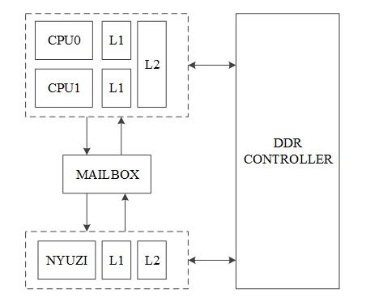
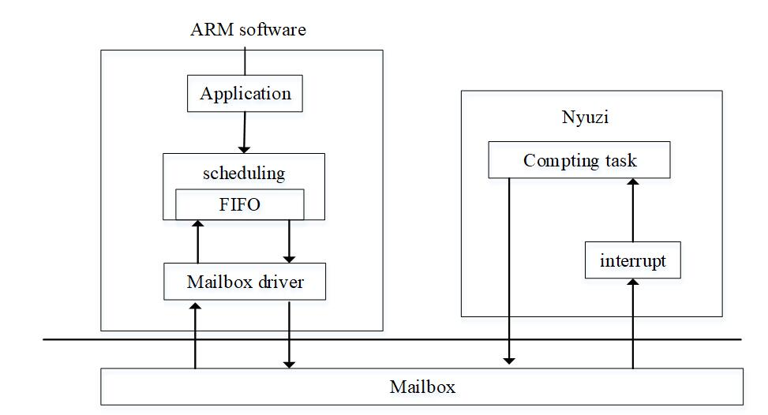
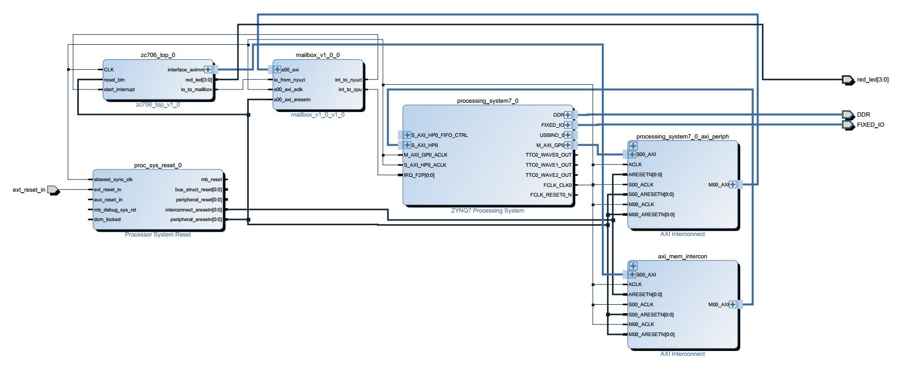

This is a project with axi connecting between arm and a gpgpu core called nyuzi which is running on the xilinx board(zc706)
nyuzi core github:https://github.com/jbush001/NyuziProcessor

nyuzi project updates frequently.Now it is optimized for use cases like blockchain mining, deep learning, and autonomous driving .The project is amazing!!!

system architechture:

It's AXI-LITE bus between mailbox and arm,since arm cores set the registers of mailbox through AXI-LITE bus.And nyuzi control the memory controller through AXI bus.

software architechture:

block design:

